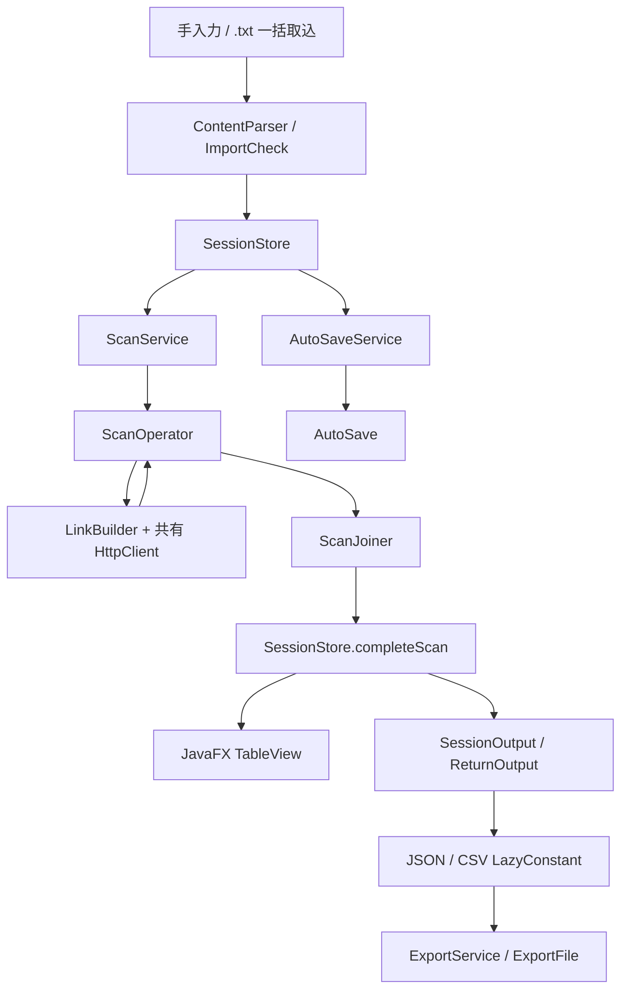

[English](README.md) | **日本語**


# URL Status Checker

複数のURLのHTTPステータスをまとめて並行チェックする、デスクトップアプリケーションです。Java 26、JavaFX、構造化並行性(`StructuredTaskScope`)で構築しており、**DOP + OOP** のハイブリッド構成を意図的に採用しています。


## 主な機能

- 複数URLの並行チェック(同時実行は最大50件)。スキャン中も行ごとに結果を随時更新します。
- `http://` と `https://` に対応。スキームを省略した場合は `https://` として扱います。
- URLの手入力と、`.txt` ファイルからの一括取込。重複や不正な行は理由を通知し、拒否された行は修正できる状態で残します。
- スキャンのキャンセル、既存行の再スキャン、1行削除、全件クリア。
- 20秒ごとの自動保存、前回セッションの復元、破損したセッションファイルからの復旧。
- 結果をJSON / CSVでエクスポート。URLに含まれる認証情報は出力せず、CSVは数式インジェクション対策済みです。

画面付きの操作手順は [How to Use](HOW_TO_USE.md)(英語)を参照してください。

## クイックスタート

**JDK 26** が必要です。プレビュー機能はGradleのビルド設定で有効化済みです。

```bash
git clone https://github.com/harugasumi-works/URL-Status-Checker.git
cd URL-Status-Checker/StatusCheck
./gradlew run     # アプリを起動(Windowsは gradlew.bat)
./gradlew test    # 単体テスト(ネットワーク不要)
```

実ネットワークへ接続する統合テストは、別タスクとして `./gradlew integrationTest` で実行します(CIには含めていません)。

## 設計のポイント

ドメインデータ(`ScanRequest`、`ScanResult`、`Outcome`、`RowItem`)は、イミュータブルなrecordとsealed interfaceで表現します。セッション管理、自動保存、スキャンのライフサイクル、JavaFXとの連携といった状態を持つ処理は、通常のクラスとサービスに任せています。

- **構造化並行性とカスタム `Joiner`。** 各タスクの完了ごとに結果をUIへ通知します。遅い、または失敗したURLがあっても、他のタスクはキャンセルされません。
- **エラーをデータとして扱う。** 通信エラー、タイムアウト、不正URLは例外として投げず `Fail` に変換します。そのため、すべてのURLが必ず一覧とエクスポートに現れます。
- **並列数の制限。** タスクスコープに加えて、`Semaphore` で同時リクエスト数を50件に制限します。
- **安全な保存。** 自動保存は一時ファイルへ書き込んでからアトミックに移動し、バックアップを保持します。UIスレッドはブロックしません。

構成の全体像は次の図のとおりです。



## 設計ドキュメント

本プロジェクトは、次の順序で設計書を整備しています。

| ドキュメント | 内容 |
|---|---|
| [要件定義書](docs/要件定義書.md) | システムの目的、対象範囲、機能要件・非機能要件、セキュリティ要件 |
| [基本設計書](docs/基本設計書.md) | システム構成、画面設計、データ設計、主要処理の流れ |
| [詳細設計書](docs/詳細設計書.md) | クラス構成、並行実行・集計・出力の詳細、スレッドモデル、エラー処理 |

上記3点をGitHub Pagesで読めるようにしたサイトもあります: https://harugasumi-works.github.io/URL-Status-Checker/

英語の補足資料として、[Architecture](docs/ARCHITECTURE.md)(処理の流れと設計上のトレードオフ)と [Development](docs/DEVELOPMENT.md)(環境、テスト、開発履歴)があります。

## 既知の制限

- UI / システムテストの専用層はありません。個人開発のため、単体テスト・サービス層テストの範囲を超える不具合が残っている可能性があります。
- 本アプリはステータスチェッカーであり、クローラーではありません。HTTPステータスのみを評価し、ページの内容は検証しません。
- リダイレクトは追跡しますが、リダイレクトの経路は結果に保持しません。最終的に3xxが返った場合は `Fail` として扱います。
- URLの検証は構文チェックのみです。有効なURLでも、DNS、TLS、サーバー側の理由で失敗することがあります。

## ライセンス

[MIT](LICENSE)
