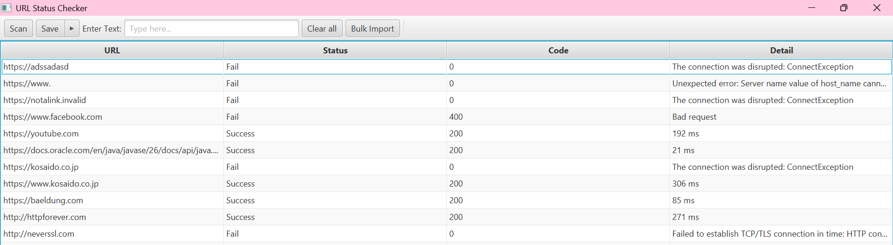
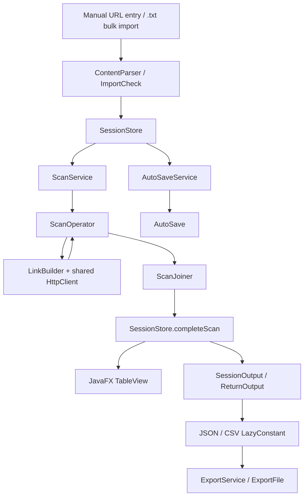

**English** | [日本語](README.ja.md)


# URL Status Checker

A desktop app that checks the HTTP status of many URLs at once. Built with Java 26, JavaFX, and structured concurrency, using a deliberate **DOP + OOP** hybrid architecture.



## Features

- Check multiple URLs concurrently (capped at 50 simultaneous requests), with per-row updates while the scan runs.
- Accept `http://` and `https://` URLs; `https://` is added when no scheme is given.
- Manual entry and bulk import from `.txt` files, with duplicate suppression and clear feedback on rejected lines.
- Cancel an active scan, re-scan existing rows, delete one row or clear the list.
- Autosave every 20 seconds, with session restore and recovery from corrupted session files.
- Export results to JSON or CSV. URL credentials are stripped and CSV output is protected against formula injection.

More screenshots and a full walkthrough: [How to Use](HOW_TO_USE.md).

## Quick start

Requires **JDK 26**. Preview features are enabled by the Gradle build.

```bash
git clone https://github.com/harugasumi-works/URL-Status-Checker.git
cd URL-Status-Checker/StatusCheck
./gradlew run     # launch the app (gradlew.bat on Windows)
./gradlew test    # unit tests, no network needed
```

## Architecture at a glance

Domain data (`ScanRequest`, `ScanResult`, `Outcome`, `RowItem`) is modeled as immutable records and sealed types. Stateful concerns such as sessions, autosave, scan lifecycle, and JavaFX wiring live in ordinary services and objects.



Key design decisions:

- **Structured concurrency with a custom `Joiner`.** Each result reaches the UI as soon as its task finishes, and one slow or failing URL never cancels the others.
- **Errors become data.** Network failures, timeouts, and malformed URLs are converted to `Fail` values instead of exceptions, so every URL always shows up in the table and the export.
- **Bounded parallelism.** A semaphore caps active requests at 50 on top of the task scope.
- **Safe persistence.** Autosave writes through a temp file with an atomic move, keeps backups, and never blocks the UI thread.

The full walkthrough, trade-offs, and package structure are in [docs/ARCHITECTURE.md](docs/ARCHITECTURE.md).

## Known limitations

- No dedicated UI/system test layer: this is a solo project, so bugs beyond unit- and service-level coverage may remain.
- It is a status checker, not a crawler: it evaluates the HTTP status only, not page content.
- Redirects are followed, but the redirect chain is not shown in the results.
- URL validation is syntactic; a valid URL can still fail on DNS, TLS, or the server side.

The full list is in [docs/ARCHITECTURE.md](docs/ARCHITECTURE.md#known-limitations).

## Documentation

| Document | Contents |
|---|---|
| [How to Use](docs/HOW_TO_USE.md) | Using the app, with screenshots |
| [Architecture](docs/ARCHITECTURE.md) | How it works, DOP + OOP design, trade-offs |
| [Development](docs/DEVELOPMENT.md) | Requirements, tech stack, testing, project history |
| [要件定義書](docs/要件定義書.md) / [基本設計書](docs/基本設計書.md) / [詳細設計書](docs/詳細設計書.md) | Formal design documents (Japanese) |

Link to the Japanese documents made by Zensical: https://harugasumi-works.github.io/URL-Status-Checker/

## License

[MIT](LICENSE)
