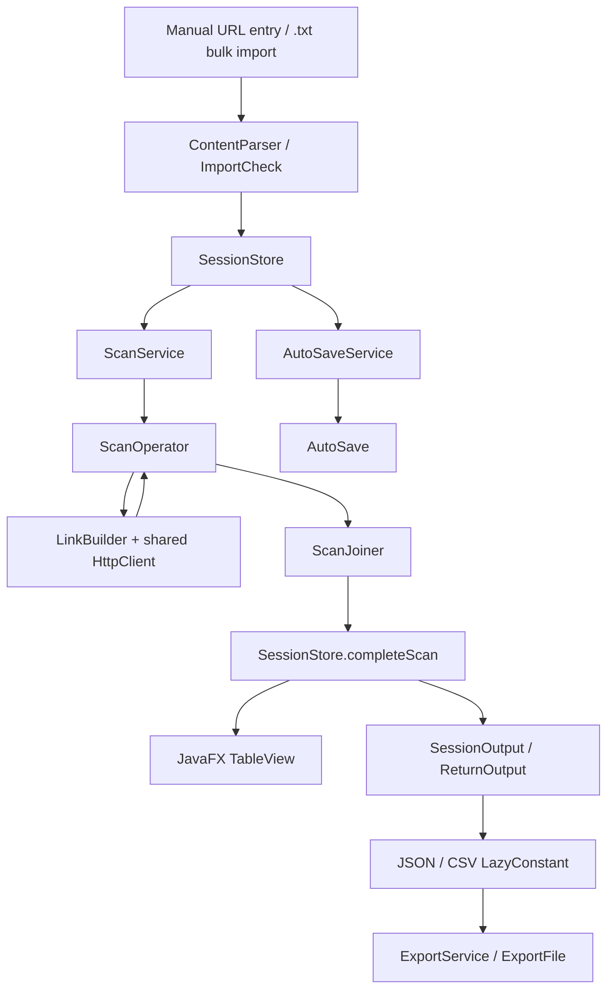

# Architecture

Design notes for URL Status Checker: how a scan flows through the system, why the code is split the way it is, and which trade-offs were made on purpose.

> Back to the [README](../README.md) · Setup, testing and project history: [DEVELOPMENT.md](DEVELOPMENT.md) · Japanese design documents: [要件定義書](要件定義書.md) / [基本設計書](基本設計書.md) / [詳細設計書](詳細設計書.md)

## How it works

The current flow is intentionally split between data-oriented domain types and stateful OOP services/controllers.



### 1. Input and normalization

Users can enter one URL directly in the main window or open the **Bulk Import** dialog.

For every input:

1. A leading BOM is removed and surrounding whitespace is trimmed.
2. An explicit `http://` or `https://` scheme is preserved.
3. If no scheme is present, `https://` is added.
4. The authority is normalized to lowercase while the rest of the path/query/fragment is preserved.
5. A single trailing `/` is removed.
6. URL validation checks URI syntax, `http`/`https` schemes, host syntax, ports, IDN conversion, and supported host forms such as IPv6 literals and underscored hostnames.

Bulk import is line-oriented. Invalid lines are kept in the import text area so they can be corrected, while valid lines are added to the session.

### 2. Duplicate filtering and session state

`SessionStore` is the single owner of the current URL list. It maintains:

- a `knownUrls` set to prevent duplicate URLs;
- an `id -> index` map for fast result lookup;
- an observable list exposed to the JavaFX table;
- a scanned-row count used to control export availability.

A URL is represented as a sealed `RowItem`: either `Pending(ScanRequest)` or `Scanned(ScanResult)`.

Scanning a URL replaces the existing row in place instead of appending a second row.

### 3. Scan lifecycle

`ScanService` owns the application-level scan lifecycle. It runs on the JavaFX Application Thread only for lifecycle/state changes and creates a JavaFX `Task` for the actual scan work.

When **Scan** is pressed, `ScanService.requestsFrom()` rebuilds a request list from the current rows. Both pending and already scanned rows are included, so pressing **Scan** performs a fresh scan of the entire current list.

While a scan is active:

- the main toolbar is disabled;
- the **Cancel scan** button remains enabled in the bottom bar;
- completed results are pushed back into `SessionStore` as they arrive.

### 4. Concurrent execution

`ScanOperator.scanAll()` converts each `ScanRequest` into a `Callable<ScanResult>` and forks the tasks into a `StructuredTaskScope` with `ScanJoiner`.

`ScanJoiner` does not build the final report itself. Instead, it sends each completed `ScanResult` to an injected callback and reports unexpected task completion failures separately. This keeps concurrency orchestration independent from UI state.

Network concurrency is additionally capped at **50 simultaneous requests** with a semaphore.

### 5. HTTP request and classification

`LinkBuilder` builds a GET request using a shared `java.net.http.HttpClient` configured for HTTP/3 and normal redirect following.

Current timeouts are:

| Setting | Value |
|---|---:|
| Request timeout | 4 seconds |
| Connection timeout | 2 seconds |
| Maximum concurrent requests | 50 |
| HTTP version | HTTP/3 |
| Redirect policy | `HttpClient.Redirect.NORMAL` |

Browser-like `User-Agent`, `Accept`, and `Accept-Language` headers are sent to reduce trivial bot-detection false positives.

Final responses are classified as follows:

| Result | Outcome |
|---|---|
| `< 300` | `Success` with timestamp, status code, and latency |
| `300–399` | `Fail` with `Redirect not followed` and a sanitized `Location` when available |
| `400–499` | `Fail` with a client-error reason |
| `>= 500` | `Fail` with a server-error reason |
| Request construction / connection / timeout / interruption error | `Fail` with status code `0` and a reason string |

Redirects are normally followed automatically. A terminal `3xx` response is still reported as a failure because the final response did not reach a non-redirect status.

Unexpected runtime failures inside an individual scan are also converted into `Fail`, so a broken task does not silently disappear from the results.

### 6. Aggregation and current output

`SessionOutput.current()` reads all currently scanned rows from `SessionStore` and converts them into `ScanResult` objects.

`ReturnOutput.fromResults()` splits the results into successes and failures, then creates a `Report` with:

```text
total         = successes + failures
successCount  = number of successes
failureCount  = number of failures
```

This means exports represent the **current scanned state of the session**, not only the most recently completed scan.

### 7. Export

The **Save** menu provides JSON and CSV export.

- JSON is produced by `JsonDto`.
- CSV is produced by `CsvDto`.
- URL credentials are removed before either format is emitted.
- CSV URL and reason fields are sanitized against spreadsheet formula injection.
- JSON and CSV conversions are wrapped in `LazyConstant`, so repeated exports reuse the already-created representation.
- `ExportFile` opens the native JavaFX file chooser and writes the selected file.

CSV columns are:

```text
timeStamp,url,outcome,statusCode,latencyMs,reason
```

### 8. Autosave and session recovery

A `Session` owns both the `SessionStore` and an `AutoSaveService`.

The autosave path is:

```text
SessionStore change
    -> version becomes dirty
    -> snapshot is taken on the JavaFX thread
    -> background single-thread executor writes the snapshot
    -> successful save advances the saved version
```

Autosave runs every **20 seconds**. If the session changes while a save is in progress, a follow-up save is queued after a successful write instead of repeatedly retrying a failed write in a tight loop.

Session files are stored under:

```text
~/StatusCheck/session.json
```

Writes use a temporary file and atomic move when supported. Up to five backup files are retained. If the stored session cannot be parsed, it is moved aside and the application starts without restoring it.

On application close, the user can **Save**, **Don't Save**, or **Cancel**. Discarding a session restores the launch-time snapshot rather than accidentally persisting changes made during that run.

## Architecture: DOP + OOP

The architecture is no longer accurately described as pure Data-Oriented Programming.

### DOP-oriented parts

The data model is still deliberately data-centric:

- `ScanRequest`, `ScanResult`, `Success`, and `Fail` are immutable records.
- `Outcome` and `RowItem` are sealed interfaces.
- `Report`, `ExecutionResult`, `ScanOutput`, and `SessionRow` are data carriers.
- Core transformations such as report summarization and output conversion are small, composable operations over immutable values.

### OOP parts

The application layer uses objects because it needs state, lifecycle, dependencies, and framework integration:

- `Session` owns the session components.
- `SessionStore` owns mutable observable state and indexing.
- `AutoSaveService` owns the autosave executor and version tracking.
- `ScanService`, `ImportService`, and `ExportService` own application workflows.
- `MainButtons`, `MainUI`, `WindowInit`, `AppState`, and dialogs coordinate JavaFX state and events.

This hybrid is intentional: DOP is used where data flow benefits from simple immutable values, while OOP is used where long-lived state and orchestration are unavoidable.

## Project structure

```text
StatusCheck/
└── lib/
    └── src/
        ├── main/java/statuscheck/
        │   ├── concurrency/   # Structured concurrency and scan joining
        │   ├── domain/        # Records, sealed types, result data
        │   ├── io/            # File import/export and persistence helpers
        │   ├── net/           # HTTP request/client construction
        │   ├── service/       # Scan/import/export application services
        │   ├── session/       # Session state and autosave lifecycle
        │   ├── ui/            # JavaFX application and views
        │   └── util/          # Parsing, validation, thread/error utilities
        └── test/java/statuscheck/
            # Unit and integration tests for core behavior and services
```

## Design trade-offs

### DOP data model, OOP application layer

Pure DOP stopped being practical once the application gained persistent session state, autosave, cancellation, JavaFX bindings, and service-level dependencies. Keeping those responsibilities inside objects avoids forcing mutable workflow state into global data transformations.

### `SessionStore` uses both a list and indexes

The observable list is the natural JavaFX representation, while `knownUrls` provides average O(1) duplicate checks and `indexById` provides average O(1) lookup when scan callbacks arrive. Removing a row requires shifting the list and reindexing subsequent IDs, so deletion is O(n). This trades a small amount of deletion work for simple and fast scan completion updates.

### Callback-based `ScanJoiner`

The joiner reports results through callbacks instead of returning an `ExecutionResult` from the structured scope. This supports incremental UI updates and keeps the concurrency package independent from the UI and session model. The trade-off is that aggregation is performed later from session state rather than directly from the joiner.

### Error-to-`Fail` normalization

Network and request-construction problems are represented as ordinary `Fail` values instead of escaping as exceptions. This keeps the row model, summary logic, and exports uniform. The trade-off is that some low-level error detail is compressed into human-readable reason strings.

A `statusCode` of `0` is reserved for failures where no HTTP response was available, such as malformed requests, connection errors, timeouts, or interruption.

### `Fail((Instant) null, 0, ...)` as a test-fixture shortcut

Some tests intentionally construct values such as:

```java
new Fail((Instant) null, 0, "...")
```

when timestamp and status code are irrelevant to the assertion. This is a deliberate choice to **reduce test-fixture complexity** rather than create unnecessary synthetic timestamps and codes. It is not the normal runtime representation of a completed scan: runtime scan paths populate a real timestamp, and a status code of `0` is used when no HTTP response exists.

### Concurrency cap of 50

`StructuredTaskScope` provides the structured task lifecycle, while a semaphore limits active network requests to 50. The cap reduces the risk of exhausting local resources or flooding targets, at the cost of making very large scans intentionally bounded rather than fully unconstrained.

### Shared HTTP client

A single thread-safe `HttpClient` is reused across scans. This keeps client setup centralized and allows connection reuse, but it also means request behavior is intentionally uniform rather than configurable per URL.

### Normal redirect following

The client follows redirects using `HttpClient.Redirect.NORMAL` instead of manually traversing them in application code. This removes custom redirect-state logic, but the application does not expose the full redirect chain in the final report.

### Local autosave with a versioned background writer

Autosave snapshots are captured on the JavaFX thread and written by a dedicated single-thread executor. This keeps file I/O off the UI thread while preventing overlapping writes. The trade-off is extra synchronization/version bookkeeping compared with a simple synchronous save.

### Pragmatic layer coupling

The application is decoupled much more cleanly than the earlier design, but it is not a strict hexagonal or clean-architecture implementation. For example, `ExportFile` uses JavaFX's `Window`/`FileChooser`, and `AutoSave` currently reports some persistence errors through the JavaFX dialog layer. These choices keep the desktop application straightforward, but they preserve framework coupling at the edges.

## Known limitations

- **Solo-development coverage limit.** No dedicated UI/system test layer: this is a solo project, so bugs beyond unit- and service-level coverage may remain.
- **This is a status checker, not a crawler.** It performs GET requests and evaluates the resulting HTTP status. It does not validate page content, application-level health semantics, or whether a page is actually usable to a human.
- **Redirect chains are not exposed.** Normal redirects are followed, but the full chain and every intermediate response are not preserved in the result model.
- **Concurrency is intentionally capped at 50 requests.** Larger URL sets are processed in waves rather than with unlimited parallelism.
- **URL validation is syntactic.** A URL can pass validation and still fail later because the host does not resolve, the network is unavailable, TLS negotiation fails, or the remote server rejects the request.
- **Bulk import is `.txt` only.** There is no CSV, bookmark-file, or directory-based batch import path.
- **No proxy/authentication configuration.** The application does not expose per-request proxy settings, custom credentials, cookies, or arbitrary header configuration through the UI.
- **Credential sanitization is output-focused.** URL user-info is removed before session persistence, JSON/CSV export, and redirect-location messages. The main table still displays the URL value entered by the user.
- **Autosave is local to one desktop account.** Session state is stored under the user's home directory and is not synchronized across machines.
- **Export is file-picker based.** There is no built-in overwrite policy, cloud export, or export history manager beyond the native file chooser.
- **Some edge cases are intentionally represented as reason strings.** Transport failures use status code `0` and text descriptions rather than a large hierarchy of specialized error types.
- **Framework coupling remains.** JavaFX types appear at the application edges and in some persistence error reporting, so the codebase is not fully framework-agnostic.

## Export format examples

CSV shape:

```csv
timeStamp,url,outcome,statusCode,latencyMs,reason
2026-09-25T09:14:02.118Z,www.google.com,Success,200,143,
2026-09-25T09:14:02.121Z,www.wikipedia.org,Success,200,187,
2026-09-25T09:14:02.130Z,www.example.com/missing,Fail,404,0,Not found
```

The exact output depends on the current session. JSON contains the report statistics plus the success/failure result collections.
